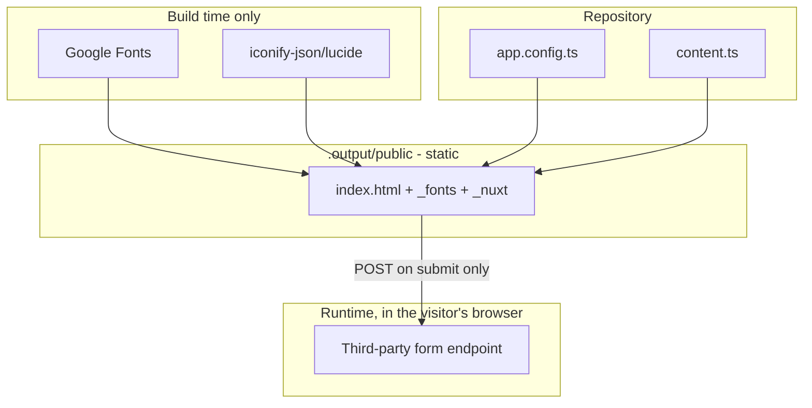

# River City Fence & Seal — Architecture

A single-page, fully prerendered marketing site for a fence painting and sealing business in Memphis, Tennessee.

Authoritative source: `nuxt.config.ts`, `app/app.vue`, `app/pages/index.vue`, `app/app.config.ts`, `app/utils/content.ts`, `app/components/`

## Components

| Component | Type | Role |
|-----------|------|------|
| `app/app.vue` | Nuxt root | `<head>`, SEO meta, `HousePainter` + `FAQPage` JSON-LD, page shell, skip link |
| `app/pages/index.vue` | Nuxt page | The only route. Its child order **is** the page order |
| `app/app.config.ts` | Runtime config | Business identity, media paths, form endpoint, Nuxt UI colour aliases |
| `app/utils/content.ts` | Content module | Services, process steps, FAQ, reviews, service areas, plan benefits |
| `app/utils/nav.ts` | Content module | Header/mobile nav anchor list |
| `SiteHeader`, `SiteFooter`, `MobileCallBar` | Vue SFC | Chrome; all three read `business` from app config |
| 11 `*Section` components | Vue SFC | One per page section, listed in `index.vue` |
| `SectionHeading` | Vue SFC | Shared eyebrow + `h2` + lede, `tone` light/dark |
| `FenceScene`, `PicketFill`, `ServiceMap`, `BrandMark` | Generated SVG | All illustration is inline SVG — no image files |
| `PhotoSlot`, `BeforeAfterSlider` | Media primitive | Resolve a real photo or a labelled placeholder (see BUSINESS-RULES.md) |
| `useScrollReveal`, `useScrolledPast` | Composable | Reveal-on-scroll; header/CTA-bar scroll state |

## Build and render flow

```
npm run generate
  │
  ├─► @nuxt/fonts  ──► downloads Fraunces + Inter, self-hosts to .output/public/_fonts/
  │
  ├─► @nuxt/icon   ──► resolves lucide from node_modules, inlines each icon as <svg>
  │                     └─ scan globInclude must cover .ts (see BUILD.md)
  │
  ├─► Vite ────────► client + server bundles
  │
  └─► Nitro prerender  ──► /, /200.html, /404.html
        │
        └─► app.vue renders head + JSON-LD
              └─► index.vue renders 11 sections in order
                    ├─ content.ts arrays drive Services / Process / FAQ / Reviews / Areas
                    └─ app.config.ts drives contact details, photos, form endpoint
```

Output is plain HTML with no server component; every section ships fully visible so the page reads without JavaScript. JavaScript adds only the reveal animation, the before/after slider, the FAQ accordion, the mobile menu, and form submission.

## Data-flow diagram



The build-time/runtime split is the load-bearing property: fonts and icons are baked in, so a served page makes **no** third-party request until a visitor submits the quote form.

## External integrations

### Google Fonts

- **Endpoint:** `fonts.googleapis.com`, `fonts.gstatic.com`
- **When:** build time only, via `@nuxt/fonts`
- **Families:** Fraunces and Inter, weights 400/500/600/700 (`nuxt.config.ts` → `fonts.families`)
- **On failure:** the build cannot fetch the faces; text falls back to the stacks declared in `app/assets/css/main.css`. Build-time network access is a prerequisite.

### Iconify (lucide)

- **Endpoint:** none at build or runtime — resolved from the local `@iconify-json/lucide` package
- **Config:** `icon.serverBundle: 'local'` plus `icon.clientBundle.scan`
- **On misconfiguration:** `@nuxt/icon` silently falls back to the Iconify HTTP API and drops icons it cannot fetch, leaving empty boxes. See BUILD.md.

### Quote form delivery

- **Endpoint:** whatever URL is set in `app.config.ts` → `forms.quoteEndpoint` (Formspree / Web3Forms / Basin)
- **Auth:** none; the endpoint URL is public by design and ships in the client bundle
- **Method:** `POST` JSON via `$fetch`
- **On failure or when unset:** see the two submission modes in BUSINESS-RULES.md

## Runtime assets

- `public/img/og-cover.jpg` — **in repo.** 1200×630 social card, generated headlessly from the site's own palette and `BrandMark` art rather than photographed. Wired up via `ogImage` / `twitterImage` in `app/app.vue`, which currently use a root-relative path; some scrapers require an absolute URL once a domain exists.
- Before/after photography — **not in repo.** `media.beforeAfter` is empty, so the slider draws its illustrated fallback. Only commit images whose licensing permits redistribution; `public/` is copied verbatim into the build.
- Gallery photography — **not in repo.** All six `media.gallery` entries are empty, so each slot renders a labelled placeholder frame instead.

## Security notes

The repository contains no secrets, and the build needs none. The only credential-shaped value is `forms.quoteEndpoint`, a public third-party URL that is necessarily visible in the shipped bundle — the provider, not this site, is responsible for abuse controls. The quote form carries a honeypot field and collects no payment or credential data. Output is static files, so there is no server-side attack surface and no runtime identity to compromise; contact details in `app.config.ts` are published deliberately.

## Related documentation

- [BUSINESS-RULES.md](BUSINESS-RULES.md) — form validation, submission modes, media resolution
- [BUILD.md](BUILD.md) — build and deployment
- [CONFIG-REFERENCE.md](CONFIG-REFERENCE.md) — configuration keys
- [TASKS.md](TASKS.md) — backlog
